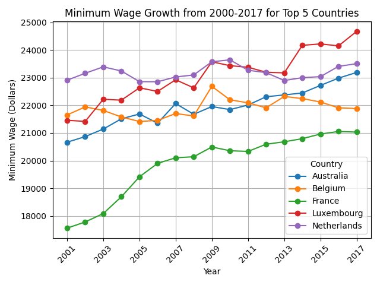

# Visualizing Datasets Project - Minimum Wages
This project explores global minimum wage data from 2000 to 2017. 

We analyze the top countries by minimum wage and examine trends over time to understand 
how wages have changed across different nations.

## Top 10 Countries by Minimum Wage in 2017

[Top 10 Countries Graph:](Images/top10_minimum_wges.png)

This bar chart shows the top 10 countries with the highest minimum wage in 2017. It highlights differences in wage levels across nations and allows us to compare the economic conditions in each country. Notice how some countries offer higher wages than others, reflecting local economic policies and labor markets.  

**Data source:** 
[Kaggle Minimum Wage Data:](https://www.kaggle.com/code/sugandhkhobragade/minimum-wages-around-the-world-eda/notebook)  

## Top 5 Countries: Minimum Wage Growth from 2000-2017

This line chart tracks the minimum wage growth for the top 5 countries based on minimum wage from 2000 to 2017. It illustrates trends over time, showing which countries have steadily increased wages and which have had slower growth. The visualization helps us understand the dynamics of wage policies over nearly two decades.  

**Data source:** 
[Kaggle Minimum Wage Data:](https://www.kaggle.com/code/sugandhkhobragade/minimum-wages-around-the-world-eda/notebook)  
